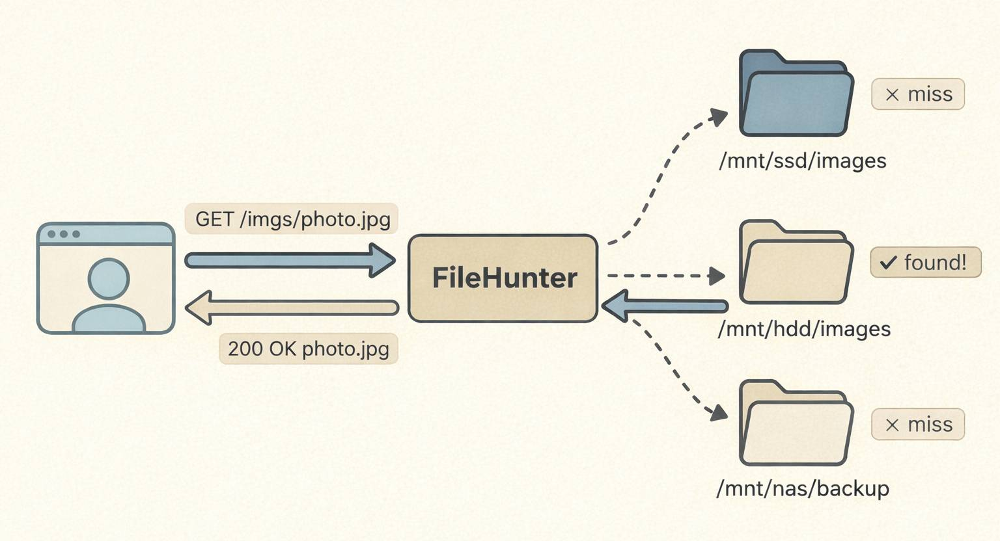

<p align="center">
  
</p>

<h1 align="center">FileHunter</h1>

<p align="center">
  <a href="https://github.com/finch-xu/filehunter/releases/latest"></a>
  <a href="https://github.com/finch-xu/filehunter/blob/main/LICENSE"></a>
  <a href="https://www.rust-lang.org"></a>
  <a href="https://github.com/finch-xu/filehunter/pkgs/container/filehunter"></a>
  <a href="https://github.com/finch-xu/filehunter/actions/workflows/github-code-scanning/codeql"></a>
</p>

<p align="center">
  <a href="README.zh-CN.md">中文</a> · <a href="https://github.com/finch-xu/filehunter/wiki">📖 Wiki</a>
</p>

<p align="center">
  
</p>

A high-performance, multi-path file search HTTP server built with Rust.

FileHunter routes requests by URL prefix to different groups of search directories, serves the first match via chunked streaming, and returns 404 if nothing is found. Designed for scenarios where files are spread across different storage paths and need to be served through organized URL endpoints.

## Highlights

- **Multi-prefix URL routing** — each `[[locations]]` maps a URL prefix to its own set of search paths and search mode
- **Per-path extension filtering** — restrict each path to specific file types (images, documents, videos, etc.)
- **Three search modes** — sequential (priority order), concurrent (fastest wins), latest_modified (newest mtime wins) — configurable per location
- **Async streaming** — built on tokio + hyper 1.x with chunked `ReaderStream` for low memory usage
- **HTTP/1.1 & HTTP/2** — automatic protocol negotiation via `hyper-util`
- **Security hardened** — path traversal protection, TOCTOU mitigation, null byte rejection, dotfile blocking, prefix segment-boundary checks, `nosniff` headers
- **Human-friendly config** — TOML format with size values like `"10MB"`, `"64KB"`
- **Tiny footprint** — ~3 MB binary (LTO + strip)

## Quick Start

### From Source

```bash
cargo build --release
./target/release/filehunter --config config.toml
```

### Docker

```bash
docker compose up -d
```

Or build manually:

```bash
docker build -t filehunter .
docker run -p 8080:8080 \
  -v ./config.toml:/etc/filehunter/config.toml:ro \
  -v /data:/data:ro \
  filehunter
```

## Configuration

All fields except `bind` and `locations` are optional with sensible defaults.

```toml
[server]
bind = "0.0.0.0:8080"

# keepalive = true
# connection_timeout = 300        # seconds, 0 = unlimited
# max_header_size = "8KB"
# max_headers = 64
max_body_size = "10MB"
# http2_max_streams = 128
max_file_size = "10MB"          # 0 = no limit
# stream_buffer_size = "64KB"

[[locations]]
prefix = "/imgs"
mode = "sequential"

[[locations.paths]]
root = "/data/images"
extensions = ["jpg", "jpeg", "png", "gif", "webp", "svg"]

[[locations]]
prefix = "/docs"
mode = "concurrent"

[[locations.paths]]
root = "/data/documents"
extensions = ["pdf", "docx", "xlsx", "txt", "csv"]

[[locations.paths]]
root = "/data/archive"
extensions = ["pdf", "docx", "xlsx", "txt", "csv"]

[[locations]]
prefix = "/"

[[locations.paths]]
root = "/data/general"
# No extensions — accepts any file type as a catch-all.
```

### How Routing Works

Each `[[locations]]` block maps a URL prefix to a group of search paths. When a request arrives, FileHunter finds the longest matching prefix, strips it, and searches within that location's paths.

**Example** with the config above:

| Request | Matched location | Searched as | Result |
|---|---|---|---|
| `GET /imgs/photo.jpg` | `prefix="/imgs"` | `photo.jpg` in `/data/images` | Sequential search |
| `GET /docs/report.pdf` | `prefix="/docs"` | `report.pdf` in `/data/documents`, `/data/archive` | Concurrent search |
| `GET /other/file.txt` | `prefix="/"` | `other/file.txt` in `/data/general` | Catch-all |
| `GET /imgs` | `prefix="/imgs"` | `/` → sanitize rejects → 404 | No file to serve |

**Prefix matching rules:**

- Longest prefix wins: if you have `/api/v1` and `/api`, a request to `/api/v1/data` matches `/api/v1`
- Segment boundary: `/imgs` does NOT match `/imgs-extra/file.jpg` (the remainder must start with `/`)
- `prefix="/"` acts as a catch-all for unmatched requests
- Requests matching no prefix return 404

### Routing Behavior by Configuration

#### Single catch-all location (`prefix="/"`)

When only `prefix="/"` is configured, all requests are handled by one location — equivalent to the simplest flat search setup:

```toml
[[locations]]
prefix = "/"

[[locations.paths]]
root = "/data/files"
```

| Request | Matched | Stripped path | Behavior |
|---|---|---|---|
| `GET /photo.jpg` | `"/"` | `/photo.jpg` | Search `photo.jpg` in `/data/files` |
| `GET /sub/dir/file.txt` | `"/"` | `/sub/dir/file.txt` | Search `sub/dir/file.txt` in `/data/files` |
| `GET /` | `"/"` | `/` | sanitize rejects empty path → **404** |
| `GET /../etc/passwd` | `"/"` | `/../etc/passwd` | sanitize rejects `..` → **404** |
| `GET /.env` | `"/"` | `/.env` | sanitize rejects dotfile → **404** |

#### Multiple prefixes

When multiple prefixes are configured, each request is routed to the best-matching location:

```toml
[[locations]]
prefix = "/imgs"

[[locations.paths]]
root = "/data/images"
extensions = ["jpg", "png"]

[[locations]]
prefix = "/api/v1"

[[locations.paths]]
root = "/data/api-v1"

[[locations]]
prefix = "/api"

[[locations.paths]]
root = "/data/api-legacy"
```

| Request | Matched | Stripped path | Behavior |
|---|---|---|---|
| `GET /imgs/photo.jpg` | `"/imgs"` | `/photo.jpg` | Search `photo.jpg` in `/data/images` |
| `GET /imgs/sub/pic.png` | `"/imgs"` | `/sub/pic.png` | Search `sub/pic.png` in `/data/images` |
| `GET /imgs` | `"/imgs"` | `/` | sanitize rejects empty path → **404** |
| `GET /imgs/` | `"/imgs"` | `/` | sanitize rejects empty path → **404** |
| `GET /imgs-hd/photo.jpg` | — | — | No prefix match (not segment boundary) → **404** |
| `GET /api/v1/users.json` | `"/api/v1"` | `/users.json` | Longest match wins → search in `/data/api-v1` |
| `GET /api/v2/data.json` | `"/api"` | `/v2/data.json` | Falls back to `/api` → search in `/data/api-legacy` |
| `GET /api` | `"/api"` | `/` | sanitize rejects empty path → **404** |
| `GET /other/file.txt` | — | — | No prefix match, no catch-all → **404** |
| `GET /%69mgs/photo.jpg` | — | — | Raw path doesn't match `/imgs` → **404** |

> **Note:** Without a `prefix="/"` catch-all, any request that doesn't match a configured prefix returns 404 immediately.

### Search Modes

Each location has its own search mode via the `mode` field:

| Mode | Behavior |
|---|---|
| `sequential` (default) | Check each root one-by-one in config order. First match wins. Deterministic — config order defines priority. |
| `concurrent` | Probe all eligible roots at the same time. The fastest match wins. Remaining searches are cancelled immediately to free resources. |
| `latest_modified` | Check all roots and return the file with the **most recent modification time**. All roots are always checked so the newest version wins. |

**Mode comparison** (N = number of eligible roots):

| | `sequential` | `concurrent` | `latest_modified` |
|---|---|---|---|
| **Which file is returned** | First match by config order | Fastest I/O response | Most recently modified |
| **I/O per request (best)** | 1 root | 1 root (parallel) | N roots (all) |
| **I/O per request (worst)** | N roots | N roots (parallel) | N roots (all) |
| **Can exit early** | Yes, on first hit | Yes, on first hit | No, must check all |
| **Local disk perf** | Optimal | Slower (spawn overhead) | Slightly slower than sequential |
| **NFS / object storage perf** | High latency stacks up | Optimal (parallel I/O) | Parallel would help but not used |
| **Result determinism** | Config order | Non-deterministic | Deterministic (by mtime) |
| **Best for** | General use, priority control | High-latency network mounts | Mirrored / staged storage |

### Subdirectory Support

Request paths can contain subdirectories of any depth. The full relative path (after prefix stripping) is joined directly to each search root — there is no recursive filename search.

**Example:** given `prefix="/imgs"` with root `/data/images`, and a file at `/data/images/photos/2024/vacation/beach.jpg`:

```
GET /imgs/photos/2024/vacation/beach.jpg

1. match     → prefix="/imgs", strip → /photos/2024/vacation/beach.jpg
2. sanitize  → photos/2024/vacation/beach.jpg   (strip leading /, validate each segment)
3. root join → /data/images/photos/2024/vacation/beach.jpg
4. security  → canonicalize + verify path is still inside /data/images
5. serve     → 200 OK (chunked stream)
```

**Key points:**

- You must provide the **exact relative path** including all subdirectories — the server will not search for the filename across directories.
- Each path segment is validated: `..`, `.`, dotfiles (`.git`, `.env`), and null bytes are all rejected.
- Symlinks are resolved; if the real path escapes the root directory, the request is blocked.

### Size Values

Size fields accept integers (`65536`) or human-friendly strings (`"64KB"`, `"10MB"`, `"2GB"`).

## Logging

FileHunter uses `tracing` with env-filter support:

```bash
# Default: info level
./filehunter --config config.toml

# Debug level
RUST_LOG=filehunter=debug ./filehunter --config config.toml
```

## Security

- Prefix segment-boundary matching (prevents `/imgs` from matching `/imgs-extra/`)
- Prefix stripped before percent-decoding (encoded path components can't bypass prefix matching)
- Path traversal blocked (`.` / `..` / symlink escape)
- Null bytes rejected
- Hidden files and directories (dotfiles) blocked
- `X-Content-Type-Options: nosniff` on all responses
- Connection timeout protection against slow-loris attacks
- Request size limits (headers + body)
- File size limit to prevent serving unexpectedly large files
- Config validation: duplicate prefixes rejected after normalization

## License

[MIT](LICENSE)
